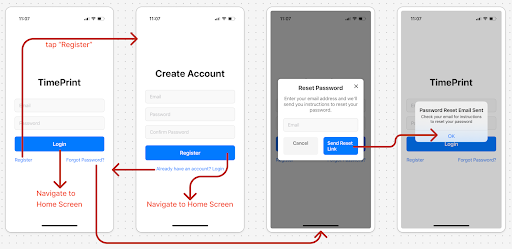
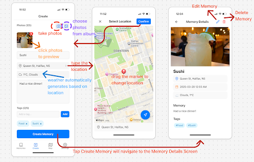
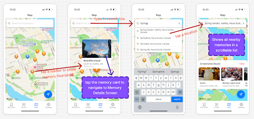
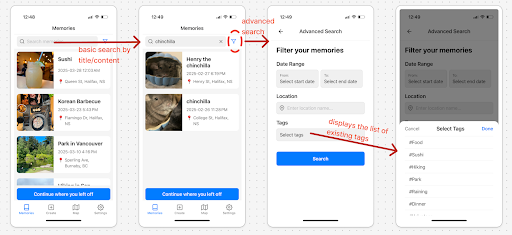
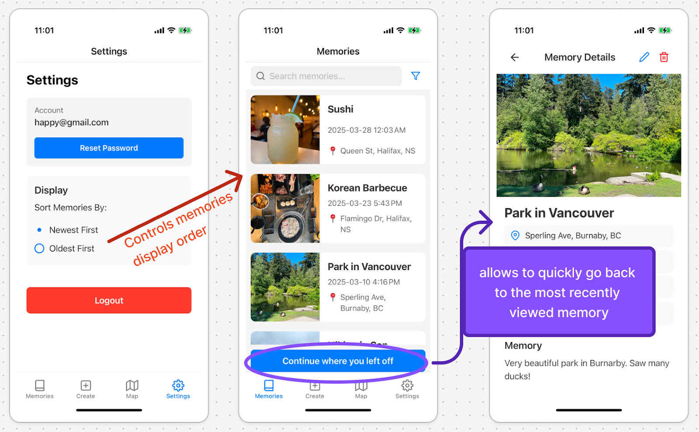

# TimePrint - Personal Memory Keeper

TimePrint is a cross-platform mobile application built with React Native that helps users capture, organize, and relive meaningful moments from both everyday experiences and special occasions. Unlike traditional photo apps, it combines photos, location data, contextual information, and personal reflections to create rich, multi-dimensional memory records.

## Demo Video

[Watch the TimePrint Demo Video](https://www.canva.com/design/DAGjbRrqtX0/K2CyRahzf6OKt4BglD-6MQ/watch?utm_content=DAGjbRrqtX0&utm_campaign=designshare&utm_medium=link2&utm_source=uniquelinks&utlId=h89f17cc6b3)

## Features

### Authentication
- Secure email/password authentication with Firebase
- Password reset functionality
- User account management



### Memory Management
- Create, view, edit, and delete memories
- Support for multiple photos per memory
- Rich text descriptions
- Automatic weather data integration
- Location tagging
- Custom tags for organization



### Location Services
- Automatic location detection
- Interactive map for manual location selection
- Reverse geocoding for human-readable addresses
- Map-based memory exploration



### Advanced Search
- Search by title and content
- Filter by date ranges
- Filter by location
- Filter by tags



### Recent Activity Tracking
- Quick access to recently viewed memories
- Seamless navigation between screens



## Technology Stack

- **Frontend Framework**: React Native
- **Navigation**: React Navigation
- **State Management**: React Context API
- **Authentication**: Firebase Authentication
- **Database**: Cloud Firestore
- **Storage**: AsyncStorage and Cloud Firestore
- **APIs**:
  - OpenWeatherMap API (for weather data)
  - Mapbox Geocoding API (for location search)
- **Maps**: React Native Maps (Google Maps on Android, Apple Maps on iOS)
- **Camera Integration**: Expo Camera

## Getting Started

### Prerequisites
- Node.js
- npm
- Expo CLI
- Firebase account

### Installation

1. Clone the repository
```bash
git clone https://github.com/hxu47/timeprint.git
cd timeprint
```

2. Install dependencies
```bash
npm install
```

3. Create a `config.js` file in the `src` directory with your API keys:
```javascript
export const FIREBASE_CONFIG = {
  apiKey: "your-api-key",
  authDomain: "your-auth-domain",
  projectId: "your-project-id",
  storageBucket: "your-storage-bucket",
  messagingSenderId: "your-messaging-sender-id",
  appId: "your-app-id"
};

export const WEATHER_API_KEY = "your-openweathermap-api-key";
export const MAPBOX_ACCESS_TOKEN = "your-mapbox-access-token";
```

4. Start the development server
```bash
npx expo start
```

## Project Structure

```
src/
├── components/       # Reusable UI components
├── screens/          # App screens
│   ├── auth/         # Authentication screens
│   ├── memory/       # Memory-related screens
│   ├── map/          # Map screens
│   ├── search/       # Search screens
│   └── settings/     # Settings screens
├── services/         # API and business logic
├── firebaseConfig.js # Firebase configuration
└── config.js         # API keys and configuration
```

## Future Enhancements
- Memory clustering on map view
- Cross-device photo synchronization
- Social sharing functionality
- Custom themes and personalization options


## Acknowledgements
- Icons provided by Feather Icons
- Weather data provided by OpenWeatherMap
- Geocoding services provided by Mapbox